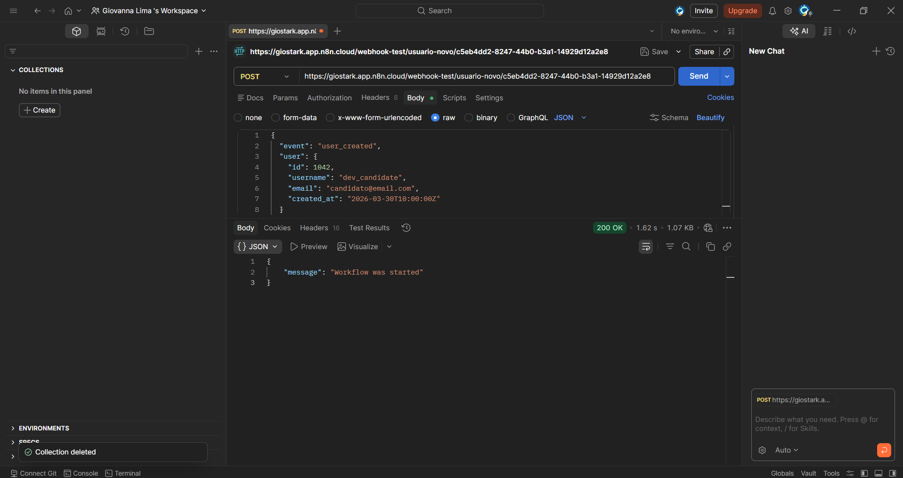
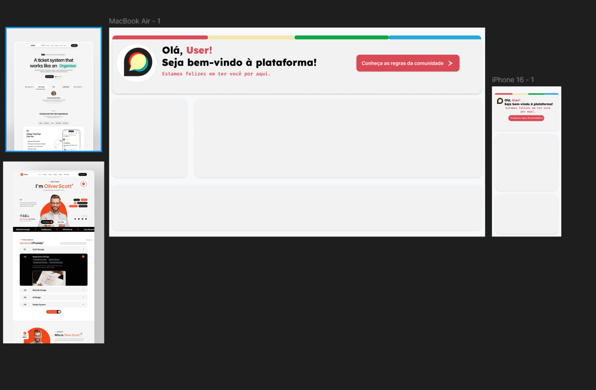

# Desafio Técnico - Automação e Front-End Discourse

## Visão Geral do Projeto
O time de Marketing/Comunidades necessitava de uma solução para automatizar a gestão de novos membros cadastrados no fórum do Discourse, eliminando o processo manual de migração de dados para o painel de acompanhamento no Monday.com.

## Objetivos
- Parte 1: Construção do fluxo no n8n (Webhook, Nó Code em JavaScript e Integração com Monday.com).
- Parte 2: Criação do Banner de Boas-Vindas responsivo em HTML/CSS para o Discourse.
- Parte 3: Comunicação e documentação não-técnica para a coordenação do time de Marketing.

## Ferramentas e Tecnologias Utilizadas
- n8n: Automação de fluxos e integração de APIs.
- JavaScript (Node.js): Regra de negócio para tratamento do JSON e saudações dinâmicas.
- Postman: Simulação e disparo da requisição HTTP (Webhook) para teste de envio de dados.
- HTML5 e CSS: Construção do banner responsivo com Flexbox.
- Figma: Prototipação do banner e definição da paleta de cores baseada no Discourse.
- Monday.com: Destino final dos dados de novos usuários em formato de quadro/planilha.

## Estrutura de Pastas do Repositório
```text
├── parte1-automacao/
│   ├── js/
│   │   └── script.js            # Script em JavaScript (regra de negócio)
│   └── workflow/
│       ├── fluxograma.png        # Imagem do fluxo montado no n8n
│       ├── postman-teste.png    # Imagem do teste da requisição no Postman
│       └── workflow-n8n.json    # Código/Exportação do fluxo do n8n
├── parte2-frontend/
│   ├── assets/                  # Imagens e recursos visuais do banner
│   ├── css/
│   │   └── style.css            # Estilização e responsividade do banner
│   └── index.html               # Estrutura principal do banner HTML
└── README.md                    # Documentação completa do projeto
```

## Resultados

### Parte 1 - Automação e Fluxo no n8n
O n8n é uma ferramenta de automação de fluxos de trabalho de código aberto e low-code. A estrutura do projeto baseia-se em 3 nós principais: Webhook, JavaScript e Monday.com.

O nó Webhook funciona como uma "ponte digital", recebendo os dados do novo usuário criado no Discourse no formato JSON. Em seguida, o nó Code (JavaScript) aplica a regra de negócio para disparar mensagens de saudação personalizadas de acordo com o domínio do e-mail. Por fim, esses dados são enviados ao Monday.com e inseridos diretamente no quadro/planilha da equipe.

O uso do Postman foi essencial para testar e validar a requisição do Webhook, garantindo o retorno da resposta com status `200 OK` (sucesso).



---

### Parte 2 - Front-End e Design
Foram utilizadas plataformas como o Pinterest para buscar inspirações visuais de banners e o Magnific para o tratamento e geração das imagens aplicadas na estilização do projeto. Além disso, o Figma foi utilizado para a prototipação inicial e responsiva do layout, com o design alinhado à paleta de cores original do Discourse.



---

### Parte 3 - Documentação para o Time de Marketing
A automação criada no n8n foi desenvolvida para eliminar a necessidade de registrar novos usuários manualmente no quadro do Monday.com, corrigindo o problema de integração que existia quando uma nova conta era criada no Discourse.

Com o n8n, estabelecemos uma "ponte digital" que conecta os dois sistemas, garantindo que qualquer pessoa cadastrada no fórum seja transferida de forma 100% automática para a planilha de acompanhamento.

Além da integração, o fluxo identifica o perfil de cada membro e gera saudações personalizadas. Caso o time de Marketing queira alterar o texto das mensagens no futuro, o processo é bem simples: basta acessar o nó de código (JavaScript) dentro do fluxo no n8n e substituir a mensagem pelo texto desejado.
